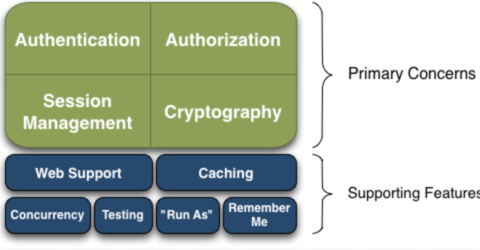

- [shiro基础](#sec-1)
  - [图示](#sec-1-1)
  - [简介](#sec-1-2)
  - [说明](#sec-1-3)
- [高级概述](#sec-2)
  - [图示](#sec-2-1)
  - [说明](#sec-2-2)
    - [Subject](#sec-2-2-1)
    - [SecurityManager](#sec-2-2-2)
    - [Realm](#sec-2-2-3)
- [架构搭建](#sec-3)
  - [maven](#sec-3-1)
    - [springboot](#sec-3-1-1)
    - [spring](#sec-3-1-2)
  - [代码](#sec-3-2)
    - [SecurityManager](#sec-3-2-1)
    - [HashedCredentialsMatcher](#sec-3-2-2)
    - [ShiroFilterFactoryBean](#sec-3-2-3)
  - [自定义](#sec-3-3)
    - [Realm](#sec-3-3-1)
    - [DefaultWebSessionManager](#sec-3-3-2)
    - [说明](#sec-3-3-3)


# shiro基础<a id="sec-1"></a>

## 图示<a id="sec-1-1"></a>



## 简介<a id="sec-1-2"></a>

Apache Shiro 是一个强大灵活的开源安全框架，提供 **认证、授权、会话管理以及密码加密** 等功能。

Apache Shiro 首要的目标是易于使用和理解。

使用 Apache Shiro 可以做到：

1.  验证用户身份。

2.  对用户进行访问控制，比如：

判断某个用户是否被赋予某个特定角色

判断某个用户是否被允许执行某些操作

1.  可以在各种环境下使用 Session API ，即使是不在web或EJB容器中。

2.  对认证、访问控制或在会话生命周期中的事件进行响应处理。

3.  可以聚合使用一个或多个安全数据的数据源而使用者只需了解一层抽象 。

4.  使用单点登录(SSO)。

5.  使用“下次自动登陆（Remember Me）”。

## 说明<a id="sec-1-3"></a>

Shiro主要面向Shiro开发团队所谓的“应用安全的四大基础” ——认证，授权，会话管理与密码加密：

1.  认证： 或“登录”，用以验证用户身份。

2.  授权： 访问控制, 比如决定谁可以访问某些资源。

3.  会话管理： 管理用户相关的session，即使是在非web或EJB应用中。

4.  加密：可以非常方便地使用（各种）加密算法保证数据的安全。

Shiro还包含了一些其他功能以支持不同的应用环境，其中：

1.  对Web的支持： Shiro自带的支持Web的API可以很容易地保证web应用的安全。

2.  缓存：缓存在Apache Shiro的API中是“一等公民”，可以保证操作的快速高效。

3.  并发： Apache Shiro的并发功能支持开发多线程的应用。

4.  测试：对测试的支持可以帮助你编写单元测试与集成测试。

5.  “以&#x2026;（身份）运行”（Run As）：允许一个用户使用另外某个用户的身份（执行操作），这个功能常用于管理场景中（比如“以管理员身份运行”）。

6.  “自动登陆”（Remember Me）：可以跨会话记住用户身份，只在某些特殊情况下才需要强制登录。

# 高级概述<a id="sec-2"></a>

## 图示<a id="sec-2-1"></a>


## 说明<a id="sec-2-2"></a>

三个主要概念： `Subject` ， `SecurityManager` 和 `Realm`

### Subject<a id="sec-2-2-1"></a>

当前用户，Subject 可以是一个人，但也可以是第三方服务、守护进程帐户、时钟守护任务或者其它&#x2013;当前和软件交互的任何事件

### SecurityManager<a id="sec-2-2-2"></a>

管理所有Subject，SecurityManager 是 Shiro 架构的核心，配合内部安全组件共同组成安全伞。

### Realm<a id="sec-2-2-3"></a>

用于进行权限信息的验证，我们自己实现。Realm 本质上是一个特定的安全 DAO：它封装与数据源连接的细节，得到Shiro 所需的相关的数据。

在配置 Shiro 的时候，你必须指定至少一个Realm 来实现认证（authentication）和/或授权（authorization）。

# 架构搭建<a id="sec-3"></a>

## maven<a id="sec-3-1"></a>

### springboot<a id="sec-3-1-1"></a>

```java
<dependency>
    <groupId>org.apache.shiro</groupId>
    <artifactId>shiro-spring-boot-starter</artifactId>
    <version>1.4.1</version>
</dependency>
```

### spring<a id="sec-3-1-2"></a>

```java
<!-- https://mvnrepository.com/artifact/org.apache.shiro/shiro-core -->
<dependency>
    <groupId>org.apache.shiro</groupId>
    <artifactId>shiro-core</artifactId>
    <version>1.4.1</version>
</dependency>
<!-- https://mvnrepository.com/artifact/org.apache.shiro/shiro-spring -->
<dependency>
    <groupId>org.apache.shiro</groupId>
    <artifactId>shiro-spring</artifactId>
    <version>1.4.1</version>
</dependency>
```

## 代码<a id="sec-3-2"></a>

### SecurityManager<a id="sec-3-2-1"></a>

1.  介绍

    shiro的核心类，SecurityManager其中两种实现方式
    
    1.  DefaultWebSecurityManager：web工程使用
    
    2.  DefaultSecurityManager：非web工程使用</p>
    
    **注意：如果在web工程中使用非web的安全管理器，那么安全管理器将不起作用**

2.  说明

    1.  设置 Realm
    
    2.  设置 SessionDAO

### HashedCredentialsMatcher<a id="sec-3-2-2"></a>

设置加密方式

### ShiroFilterFactoryBean<a id="sec-3-2-3"></a>

工厂类，将核心SecurityManager添加到工厂类中，

设置过滤器链等。

1.  过滤器链说明

    1、一个URL可以配置多个 Filter，使用逗号分隔
    
    2、当设置多个过滤器时，全部验证通过，才视为通过
    
    3、部分过滤器可指定参数，如 perms，roles

2.  Shiro 内置的 FilterChain

    | Filter Name | Class                                                            | describe                   |
    |----------- |---------------------------------------------------------------- |-------------------------- |
    | anon        | org.apache.shiro.web.filter.authc.AnonymousFilter                |                            |
    | authc       | org.apache.shiro.web.filter.authc.FormAuthenticationFilter       | 可以自己实现自定的验证方式，如：手机号验证，验证码等 |
    | authcBasic  | org.apache.shiro.web.filter.authc.BasicHttpAuthenticationFilter  |                            |
    | perms       | org.apache.shiro.web.filter.authz.PermissionsAuthorizationFilter |                            |
    | port        | org.apache.shiro.web.filter.authz.PortFilter                     |                            |
    | rest        | org.apache.shiro.web.filter.authz.HttpMethodPermissionFilter     |                            |
    | roles       | org.apache.shiro.web.filter.authz.RolesAuthorizationFilter       |                            |
    | ssl         | org.apache.shiro.web.filter.authz.SslFilter                      |                            |
    | user        | org.apache.shiro.web.filter.authc.UserFilter                     |                            |
    
    **说明**
    
    1.  anon:所有 url 都都可以匿名访问
    
    2.  authc: 需要认证才能进行访问
    
    3.  user:配置记住我或认证通过可以访问

## 自定义<a id="sec-3-3"></a>

### Realm<a id="sec-3-3-1"></a>

extends AuthorizingRealm ，重写认证授权方法

### DefaultWebSessionManager<a id="sec-3-3-2"></a>

`extends DefaultSessionManager implements WebSessionManager` 用于存储和获取sessionId

自定义的方式 `extends DefaultSessionManager implements WebSessionManager` 参照DefaultWebSessionManager实现Header中添加x-auth-token

1.  onStart()

    调用subject.login(token)触发

2.  onStop()

    调用subject.logout();触发

3.  protected Serializable getSessionId(SessionKey sessionKey)

    登录后每次根据cookie或者header进行验证都会调用这个方法

### 说明<a id="sec-3-3-3"></a>

subject是用于提交的实体，由SecurityUtils获得。

Subject subject = SecurityUtils.getSubject();

subject.login(token);

subject.logout();
